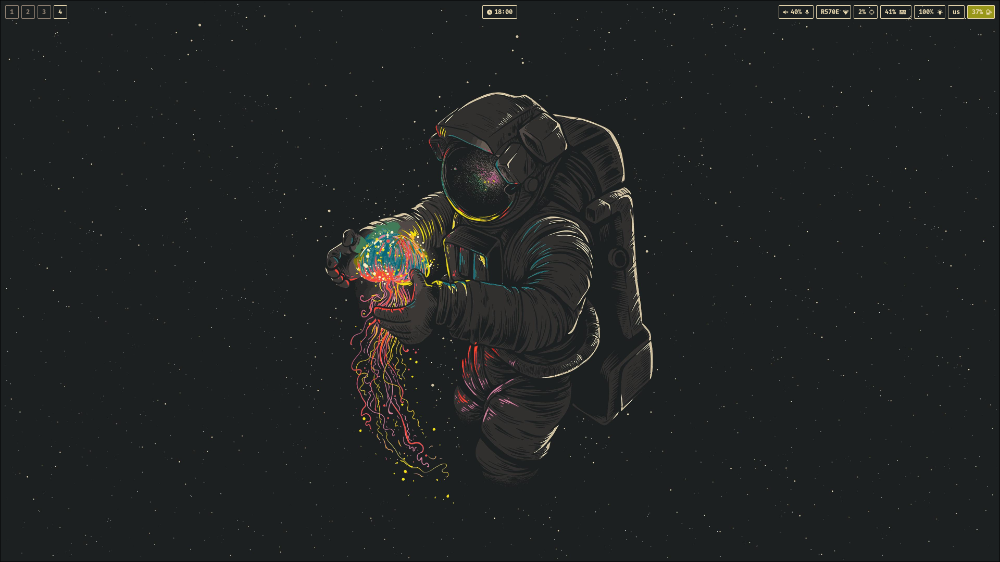

# 🍐 GRUSSIA - Gruvbox theme from Russia



## Quick start

>[!note]
>Configuration was tested on ALT Linux Regular MATE.


#### Removing useless soft

```shell
# Go away from TTY1
# Press CTRL+ALT+F2

su -

apt-get remove --purge xorg-*
apt-get remove --purge mate-*
apt-get remove --purge lightdm-*

# Optional
apt-get remove --purge gparted
apt-get remove --purge cpu-z
apt-get remove --purge mpv
apt-get remove --purge nano
apt-get remove --purge vim-common
apt-get remove --purge altmediawriter
```

#### Installing windows manager with deps


```shell
apt-get update

apt-get install gcc
apt-get install ripgrep
apt-get install node npm

apt-get install flatpak

apt-get install alacritty neovim tmux
apt-get install hyrpland hyprland-qtutils hyprcursor hyprpaper hypridle hyprlock hyprshot xdg-desktop-portal-hyprland waybar

apt-get install fonts-ttf-fira-code fonts-ttf-fira-code-nerd
```

#### Copy configs

```shell
# Bash profile
cp configs/.bash_profile /home/$USER/

# Alacritty
mkdir -p ~/.config/alacritty/themes
git clone https://github.com/alacritty/alacritty-theme ~/.config/alacritty/themes
cp configs/alacritty/ ~/.config/alacritty/

# Hyprland
cp configs/hypr/ ~/.config/

# Neovim
git clone https://github.com/NvChad/starter ~/.config/nvim && nvim
# Copy manually from configs/nvim

# TPM & Tmux
git clone https://github.com/tmux-plugins/tpm ~/.tmux/plugins/tpm
cp configs/.tmux.conf /home/$USER/
# Press in tmux prefix+I to install
```
